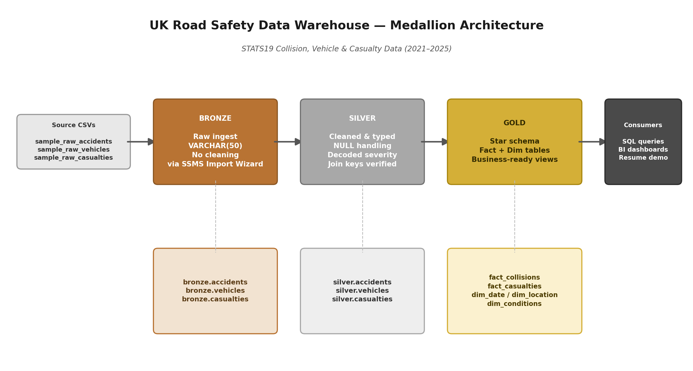

# UK Road Safety Data Warehouse

A SQL Server data warehouse built on the UK Department for Transport's official
road safety (collision) data, using the **Medallion Architecture**
(Bronze → Silver → Gold) to take raw government CSVs through cleaning,
typing, and modeling into business-ready analytical views.



## Overview

| | |
|---|---|
| **Source data** | [gov.uk Road Safety Open Data](https://www.gov.uk/government/statistical-data-sets/road-safety-open-data) |
| **Tables** | Collisions, Vehicles, Casualties |
| **Date range** | 2021–2025 (5 years) |
| **Tooling** | Microsoft SQL Server / SSMS |
| **Architecture** | Medallion (Bronze / Silver / Gold) |

This dataset is split across three linked files: one row per collision, one
row per vehicle involved in a collision, and one row per person injured or
killed. All three are joined on a shared collision reference key.

## Why this project

Most portfolio projects reuse the same handful of overused datasets
(Titanic, Iris, generic e-commerce data). This project instead uses a real,
messy, government-published dataset that requires genuine data cleaning —
inconsistent nulls, sentinel values, coded fields that need decoding — and
demonstrates a full warehouse pipeline end to end rather than a single
notebook of exploratory analysis.

## Architecture

**Bronze — raw ingest**
CSV files loaded as-is into permissive `VARCHAR(50)` columns via SSMS's
Import Flat File Wizard, with no cleaning applied. This preserves an
auditable, reproducible copy of the source data exactly as delivered.

**Silver — cleaned & typed**
Raw text converted into proper types (`INT`, `DATE`, `FLOAT`, etc.), sentinel
values (e.g. `-1` for "missing") converted to real `NULL`s, coded severity
fields decoded into readable labels (`Fatal` / `Serious` / `Slight`), and
join keys verified across all three tables.

**Gold — business-ready star schema**
Fact and dimension tables (`fact_collisions`, `fact_casualties`, `dim_date`,
`dim_location`, `dim_conditions`) plus a set of analytical views answering
real questions: yearly trends, weekend vs weekday risk, high-risk locations,
weather/road condition risk factors, and casualty demographics.

## Repository Structure

```
uk-road-safety-data-warehouse/
│
├── README.md
│
├── data/
│   └── raw/                       ← 1,000-row samples of each source file
│       ├── sample_raw_accidents.csv
│       ├── sample_raw_vehicles.csv
│       └── sample_raw_casualties.csv
│
├── scripts/
│   ├── init_database.sql       ← CREATE DATABASE + bronze/silver/gold schemas
│   │
│   ├── bronze/
│   │   ├── ddl_bronze.sql         ← raw table definitions
│   │   └── load_bronze_notes.md   ← how the raw data was loaded (SSMS wizard)
│   │
│   ├── silver/
│   │   ├── ddl_silver.sql         ← cleaned, typed table definitions
│   │   └── load_silver.sql        ← cleaning + transformation logic
│   │
│   └── gold/
│       ├── ddl_gold.sql           ← fact/dimension table definitions
│       └── views_gold.sql         ← business-ready analytical views
│
└── docs/
    └── architecture_diagram.png
```

> **Note:** Full 5-year source files are not committed to this repo due to
> size. Only 1,000-row samples are included in `data/raw/` for reference —
> the complete files can be downloaded directly from the
> [gov.uk data portal](https://www.gov.uk/government/statistical-data-sets/road-safety-open-data).

## How to Run

1. Download the full collision, vehicle, and casualty CSVs (2021–2025) from
   the gov.uk link above.
2. Run `scripts/init_database.sql` to create the database and the three
   schemas.
3. Run `scripts/bronze/ddl_bronze.sql`, then import the CSVs into the
   `bronze` schema (see `load_bronze_notes.md` for the exact steps used).
4. Run `scripts/silver/ddl_silver.sql` followed by
   `scripts/silver/load_silver.sql`.
5. Run `scripts/gold/ddl_gold.sql` followed by `scripts/gold/views_gold.sql`.
6. Query any view in `gold`, e.g.:
   ```sql
   SELECT * FROM gold.v_accidents_by_year_severity;
   SELECT * FROM gold.v_monthly_collision_trend ORDER BY collision_year, month_no;
   ```

<!-- TODO: power bi screen shots-->
<!-- ## Sample Insights

-->

## Tech Stack

- Microsoft SQL Server / SSMS
- SQL (DDL + DML)
- Medallion Architecture (Bronze / Silver / Gold)

## Author

**Ankit Dhakad**
(Final-year ECE student, NIT Delhi)
<br>
GitHub:-  [check-out](https://github.com/AnkitDhakad4) 
<br>LinkedIn:- [check-out](https://linkedin.com/in/ankitdhakad4)
